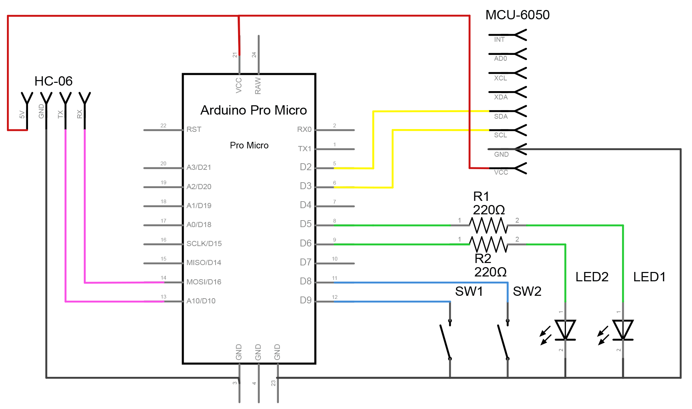
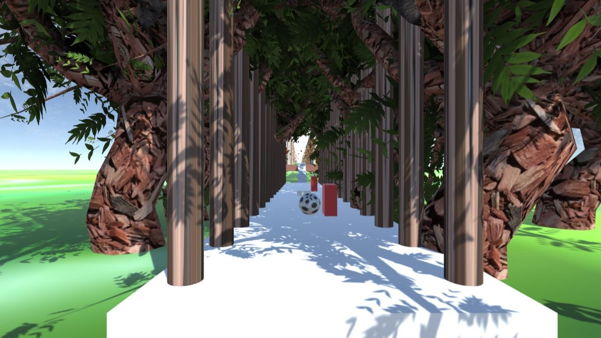

# Gesture-Recognition-module

This module will be able to convert our hand movement into charecters and symbols. Our idea is to convert the accelorometer data of our hand movement into the sequence of charecters.

## Requirements

| Name of the component    | Quantity |
| :----------------------- | :------: |
| Accelerometer MPU6050    |    1     |
| Arduino Pro Micro/ Nano  |    1     |
| Bluetooth Module         |    1     |
| Push Button              |    2     |
| LED                      |    2     |
| Resistor (220Ω)          |    2     |

### Arduino IDE

I made an small repository regarding the installation, sample circuits & sketches that related arduino in all the projects that i have done. Please go through it carefully.

### Python

The library it's written in Python and uses Scikit-learn's SVM (Support Vector Machine) algorithm to classify the signals into letters.

If you are using windows, the easiest way to download the needed libraries is to [download the Python(X,Y) distribution here.](https://python-xy.github.io/). It comes with all the necessary software built in.

## Electrical Circuit & Working Principle

Microcontroller(ArduinoNano)is used to take signals from accelerometer(SCL,SDA). One pushbutton is used to control the data from accelerometer to microcontroller which is indicated by one of the lED’s. Another pushbutton is used to control the data sent i.e, either via bluetooth module or cable which is also indicated by the other LED. Bluetooth module is used for connecting the microcontroller and device(i.e., PC) using RX and TX communication. Powerbank usually powers the microcontroller or you can use the USB cord and turn off the Bluetooth module.



Once button is pressed an accelerometer gives signals to microcontroller which contains acceleration data (ax,ay,az,Gx,Gy,Gz). For a particular character (case sensitive) we take around 100 data sets for precise working of the module and save them in a file named ”data”. In this way all the charecters required are recorded with gestures. Then, all these data are grouped using support vector machine learning algorithm(SVM). Now for a given gesture it calls the closest one in the ”data”. All the signals are communicated either through HC-06 or arduino cable. You can refer to Prototype we made in images folder.

## Steps

The above code is to train and predict the dataset. Serialport in the code is written according to the correspondig port of communication. While training the datasets,a particular gesture is mapped to a particular character, so for charecter ”a” we can assign any gesture. The trained data set is stored in a file named ”data”. Pyautogui is used virtuallly to press keys on keyboard. While predicting the character predicted is pressed virtually on keyboard. The code also enables the text to be stored in an output.txt file. ”Learn.py” code in the link groups the data sets by using SVM algorithm. The root mentioned in the code must be the directory that contains the datasets (here ”data”). The other codes in the link are libraries which are called in these main codes.

The following commands are used in this project.

```bash
python start.py target=a:0 port=YOURSERIALPORT
```

This command records data according to the character given in command(here its ”a”)and batch number(”0”).

```bash
python learn.py
```

When the dataset is ready , learn them using the above command.

```bash
python start.py port=YOURSERIALPORT predict
```

The above command predicts particular gesture . Upload the arduino code to the microcontroller currently used.

## Gesture controlled game

Since we can control the keys on keyboard, so we can play all the games that are played by keyboard. Here’s a simple game that depicts above line. Game is played by keys ”a” and ”d” on keyboard.



To build this game we used Unity engine which has inbuilt microsoft visual studio where C# language is used. When key ”a” is pressed the ball moves to right and when ”d” is pressed the ball moves left. While playing the game ball faces obstacles,coins,powerups. The below link gives all the codes used in this game. In ”start.py” here we can use only two gestures mapped to two charecters(a and d)so that we can decrease thenumber of datasets. Accordingly in ”learn.py” specific dataset is renamed.

## Errors faced and solutions

If you have faced any errors mentioned below. please make suggested changes and try it. If you have faced any other errors let me know.

```python

Traceback (most recent call last): File ”<stdin>”, line 1, in <module> File ”/usr/local/lib/python2.7/dist-packages/matplotlib/init.py”, line 128, in <module>
from matplotlib.rcsetup import defaultParams, validatebackend, cycler File ”/usr/local/lib/python2.7/dist-packages/matplotlib/rcsetup.py”, line 29, in <module>
from matplotlib.fontconfigpattern import parsefontconfigpattern
File ”/usr/local/lib/python2.7/dist-packages/matplotlib/fontconfigpattern.py”, line 32, in <module>
from backports.functoolslrucache import lrucache
ImportError: No module named functoolslrucache
```

Problem occurred due to matplotlib version 2.2.0. The command mentioned below solves the above issue.

```bash
pip install matplotlib==2.0.2
```

Make sure you keep BAUDRATE same for everything i.e.,38400 and unique serial port

## Future plans

We want to scale the structure to the pen and add a sd card module back to store the accelorometer data so that we can process the data in the computer to get the documented format of our hand written script. We also want to develop the algorimthm by bringing image processing. We also want to train many languages at same time. To create a wireless mouse pen used to do modelling or doodling easily.

## Contributor

[aghinsa](https://github.com/aghinsa)

## Acknowledgements

I thank all people who helped me in completing the project.
